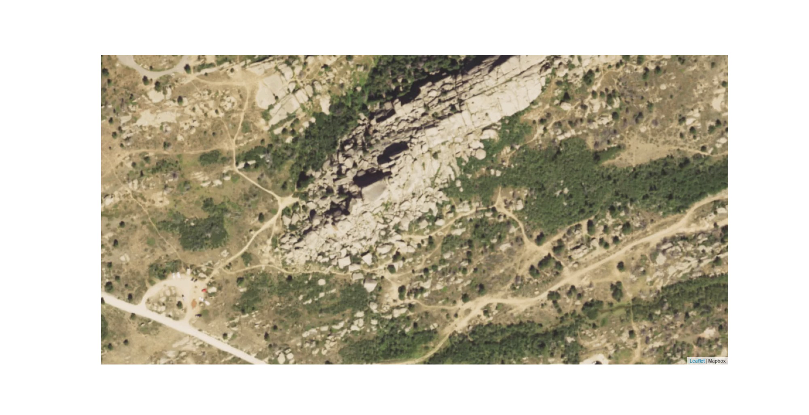
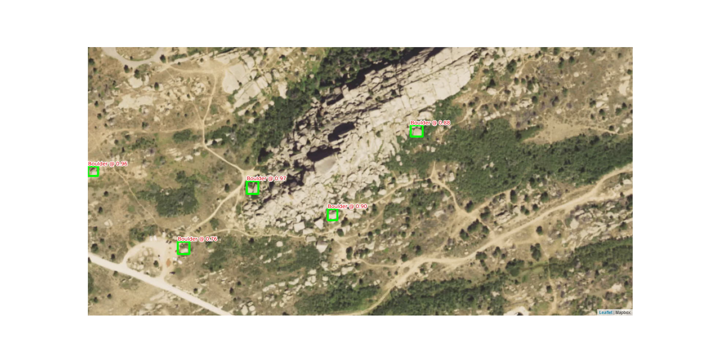

# Finding Awesome Boulders

### What typically happens

Leavenworth, WA:

## Outline of project

I wanted to work on a ML project mainly for my resume, but this process is automating
something I have likely spent over 100 hours doing manually. Somewhat ironically,
this project took me about 300 hours to get to a point where I can call it 'complete'.

Don't expect me to ever release the ML model as a web service or something. This will always
have to be done manually in Python as I don't care about the overhead with getting a computer
vision model to work on the web.

To obtain the .pt file needed to predict please email me at: jlombard314@gmail.com

### Code summary

Folder 'modeling': SSD is only filled out. This contains the code to train your own model
as well as predict on a model.

Folder 'scrapingData': Contains code for web scraping GPS coordinates as well as
visualizing how training data will be generated.

Folder 'generatingData': Contains the code for generating training data from GPS
coordinates.

#### Training Data

Training data was gathered via GPS coordinates from [Mountain Project](https://www.mountainproject.com/).
For a given coordinate (boulder), Geckodriver is used to: generate a HTML map, via mapbox or whatever other provider,
export an image, then 'paint' the data with the other boulders in the area. The training data
assumes a certain size for each boulder, regardless of reality. For each coordinate we obtain
an image and it's associated bounding boxes in XML form. These are eventually sliced for modeling
purposes.

Training data was not scraped for the entirety of submissions to mountain project; unfortunately,
the process to add in a GPS coordinate is annoying on the website. There are ALOT of coordinates
that are incorrect. The author manually found areas that have reliable GPS 
and used these in the training data gathering. The majority of this data is from Unaweep Canyon.

Regions of interest were also limited to the Western United States. There are a lot of temporal issues
that arise with satellite imagery in forested areas. The Adirondacks, for example, would not have any
boulders detected due to forest cover from late spring to fall. The author wished for some sort of
'penetrating' image to account for this but could not find it.

Various types of object detection models were tried: FRCNN, SSD, and YOLO. The author got annoyed with YOLO
and compiling stuff, and FRCNN seemed to be a very crappy model (due to training data limitations).

Satellite imagery choices were also varied: google satellite, ESRI, and mapbox sources were tried.
Mapbox proved to be the 'best', which is supported anecdotally from other satellite imagery detection models.

To understand my general process: look at `experimental_earthExplorer.py` to see how it works manually. That is,
how the training data generation works manually.

## Predicting on your own

You need your own Mapbox API key. The file: modeling > ssd > prediction_runner.py
is a somewhat generic script for running predictions for a given model. 

Note that I found much better accuracy for areas when I retrained models after hand labeling
additional data. Ex: I didn't feed the model data from Vedauwoo. I hand labeled some data
for Vedauwoo, trained from the last model iteration for the full training data set, then predicted
from this 'updated' model. That provided better results but expect to label >50 boulders for it
to work well.

### Training on your own

Good luck. In the ideal I would use Docker or something to make this easier but
I am not really interested in that amount of effort. The `generate_training_data.py`
files are where you should start, where the generating_data folder has most of the
workhorse functions. I purchased a $1600 PC to train specifically for this project.

The training data is large >50 GB. You need to generate training data on your own as well
as train the model on your own.

My PC specs:

CPU: Intel Core i5 11400

Motherboard: ASRock B560M-C

Memory: 32GB G.Skill Trident Z RGB DDR4 3600 mhz (4x 8GB)

GPU: GeForce RTX 3060, 12GB

OS: Windows 10

Selenium is used for this project. I found geckodriver on firefox to work best
with Python.

## Thank you

To the people who submit GPS coordinates accurately! These are:

Nick Reecy and others for Unaweep Canyon

Submitters for the Bishop Area

Salamanizer Ski for his areas in NE California
